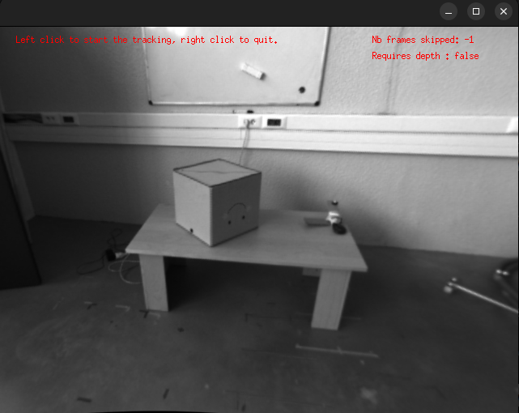
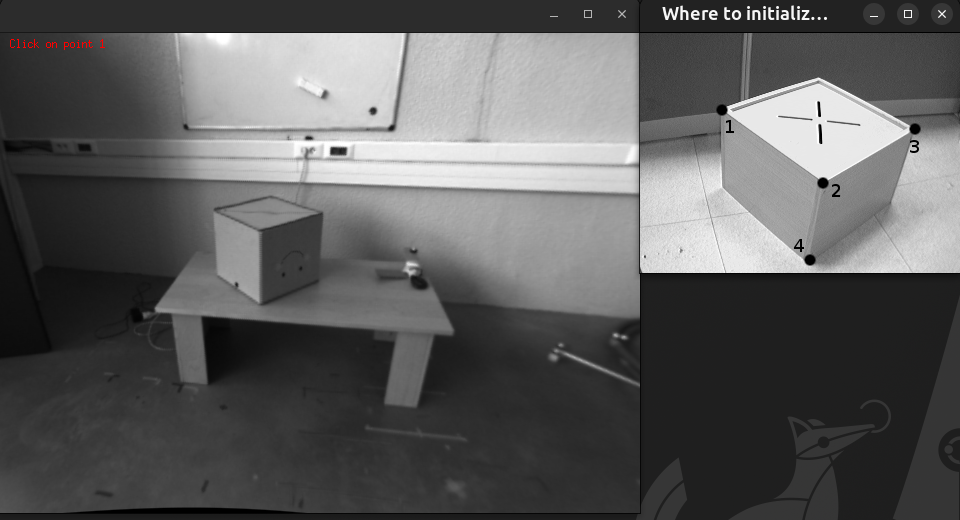
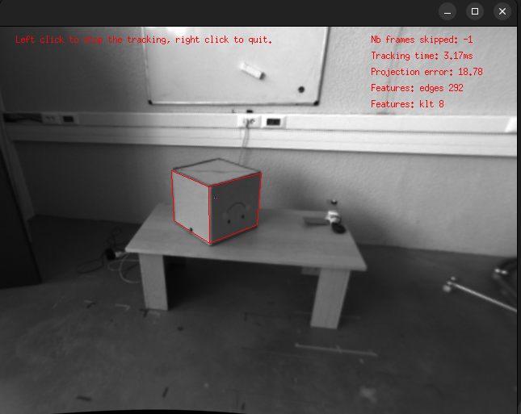

Model-Based Tracker (MBT) tutorial
==================================

This is a tutorial for the ``visp_mbt`` package. The documentation of the Model-Based Tracker (MBT) provided
by ViSP can be found `here <https://visp-doc.inria.fr/doxygen/visp-daily/classvpMbGenericTracker.html>`__
ViSP documentation also provides step-by-step tutorials to progressively learn how to use the MBT
`here <https://visp-doc.inria.fr/doxygen/visp-daily/tutorial-tracking-mb-generic.html>`__ .

Consequently, this tutorial will not focus on explaining the meaning of the different parameters of the
MBT, but instead focus on the specificities on how to use the ``visp_mbt`` package.

A node of the ``visp_mbt`` package can either be initialized using a `JSON` configuration file or an `XML` configuration
file. Depending on the type of the configuration file, some parameters of the node must be or must not be set.
Consequently, we will study the two cases separately.

Tutorial using a JSON file
--------------------------

Purpose of this tutorial
++++++++++++++++++++++++

The purpose of this tutorial is to show how to configure a ``visp_mbt`` node using a JSON file.
We begin with this kind of file because it is the simplest way of configuring the node.
If you have the choice between the XML and the JSON options, we suggest you to use a ``JSON`` file.
See `ViSP tutorial <https://visp-doc.inria.fr/doxygen/visp-daily/tutorial-mb-generic-json.html>`__ for
more information.

How to launch it
++++++++++++++++
If you compiled the packages, you have to source the workspace in which you have compiled the packages.
Otherwise, if you installed the packages using the package manager, you only have to source the ``/opt/ros/${ROS_DISTRO}/setup.bash``
file (or one of the other ``setup`` files if you are not using bash).

Then you can run:

.. code-block:: shell

  ros2 launch visp_tk_tutorials mbt_json_launch.py

The launch file accepts different arguments. To have the list and the explanations related to the
arguments, please run:

.. code-block:: shell

  ros2 launch visp_tk_tutorials mbt_json_launch.py --show-args

When you first start the launch file, you should see something similar to the following image:

After left clicking on the image, the tracker will be turned on, and you should see

After having click on the corners of the cube, respecting the ordering explained in the small
window that opened on the side, you should see the cube being tracked. A left click will momentarily pause
the tracker, while a right click will kill the node.

Code explanation
++++++++++++++++

Let's have a look at ``mbt_json_launch.py``. Because it is a fairly big file, we will study the parts
separately. Let's first have a look to the :py:func:`generate_launch_description` method that is called
by the ``ros2 launch`` utilitary or by a call to ``IncludeLaunchDescription`` in another launch file:

.. literalinclude:: /_code/launch/mbt_json_launch.py
  :language: python
  :lineno-match:
  :start-at: def generate_launch_description():
  :end-at: return ld

As you can see, the :py:func:`generate_launch_description` method mostly declare the launch arguments and
register an :py:class:`OpaqueFunction` object that will be called once the context of the launch file will
be known. However, it is important to notice that it also sets an OpenMP environment variable. It helps accelerate
the processing of depth images when the depth stream is used too.

Here is a quick overview of the :py:func:`prepare_parameters` function:

.. literalinclude:: /_code/launch/mbt_json_launch.py
  :language: python
  :lineno-match:
  :start-at: def prepare_parameters(context):
  :end-before: def generate_launch_description():

First, we get the launch arguments values and store them in a dictionnary that will serve
at initializing the node:

.. literalinclude:: /_code/launch/mbt_json_launch.py
  :language: python
  :lineno-match:
  :start-at: ## [Getting the launch arguments values]
  :end-before: ## [Checking the validity of some launch arguments]

Then, we check the validity of some launch arguments. The parsing of empty lists in ROS2 can
be problematic, so we have to use a small trick to handle that case:

.. literalinclude:: /_code/launch/mbt_json_launch.py
  :language: python
  :lineno-match:
  :start-at: ## [Checking the validity of some launch arguments]
  :end-before: ## [Instanciating the node]

Then, we instanciate the ``visp_mbt`` node, using the dictionnary that we previously filled:

.. literalinclude:: /_code/launch/mbt_json_launch.py
  :language: python
  :lineno-match:
  :start-at: ## [Instanciating the node]
  :end-before: ## [Rosbag player]

Then, we create a process that will play the rosbag:

.. literalinclude:: /_code/launch/mbt_json_launch.py
  :language: python
  :lineno-match:
  :start-at: ## [Rosbag player]
  :end-before: ## [Launching nodes]

Then, we group the spawning of the node and of the process into a :py:class:`GroupAction` object:

.. literalinclude:: /_code/launch/mbt_json_launch.py
  :language: python
  :lineno-match:
  :start-at: ## [Launching nodes]
  :end-before: ## [Handling shutdown]

Finally, we ask to shutdown the whole launch file when the ``visp_mbt`` node dies:

.. literalinclude:: /_code/launch/mbt_json_launch.py
  :language: python
  :lineno-match:
  :start-at: ## [Handling shutdown]
  :end-before: def generate_launch_description():

Tutorial using an XML file
--------------------------

Purpose of this tutorial
++++++++++++++++++++++++

The purpose of this tutorial is to show how to configure a ``visp_mbt`` node using an XML file.
If you have the choice between the two options, we suggest you to use a ``JSON`` file instead,
but you may not have the possibility if ViSP has not been compiled with the required dependency.
See `ViSP tutorial <https://visp-doc.inria.fr/doxygen/visp-daily/tutorial-mb-generic-json.html>`__ for
more information.

How to launch it
++++++++++++++++
If you compiled the packages, you have to source the workspace in which you have compiled the packages.
Otherwise, if you installed the packages using the package manager, you only have to source the ``/opt/ros/${ROS_DISTRO}/setup.bash``
file (or one of the other ``setup`` files if you are not using bash).

Then you can run:

.. code-block:: shell

  ros2 launch visp_tk_tutorials mbt_xml_launch.py

The launch file accepts different arguments. To have the list and the explanations related to the
arguments, please run:

.. code-block:: shell

  ros2 launch visp_tk_tutorials mbt_xml_launch.py --show-args

When you first start the launch file, you should see something similar to the following image:

After left clicking on the image, the detector will be turned on, and you should see

After having click on the corners of the cube, respecting the ordering explained in the small
window that opened on the side, you should see the cube being tracked. A left click will momentarily pause
the tracker, while a right click will kill the node.

Code explanation
++++++++++++++++

Let's have a look at ``mbt_xml_launch.py``. Because it is a fairly big file, we will study the parts
separately. Let's first have a look to the :py:func:`generate_launch_description` method that is called
by the ``ros2 launch`` utilitary or by a call to ``IncludeLaunchDescription`` in another launch file:

.. literalinclude:: /_code/launch/mbt_xml_launch.py
  :language: python
  :lineno-match:
  :start-at: def generate_launch_description():
  :end-at: return ld

As you can see, the :py:func:`generate_launch_description` method mostly declare the launch arguments and
register an :py:class:`OpaqueFunction` object that will be called once the context of the launch file will
be known. However, it is important to notice that it also sets an OpenMP environment variable. It helps accelerate
the processing of depth images when the depth stream is used too. It is also interesting to notice that in the case
of using an XML configuration file, the parameters ``rgb_model_file``, ``tracker_names`` and ``tracker_types`` must be set.

Here is a quick overview of the :py:func:`prepare_parameters` function:

.. literalinclude:: /_code/launch/mbt_xml_launch.py
  :language: python
  :lineno-match:
  :start-at: def prepare_parameters(context):
  :end-before: def generate_launch_description():

First, we get the launch arguments values and store them in a dictionnary that will serve
at initializing the node:

.. literalinclude:: /_code/launch/mbt_xml_launch.py
  :language: python
  :lineno-match:
  :start-at: ## [Getting the launch arguments values]
  :end-before: ## [Checking the validity of some launch arguments]

Then, we check the validity of some launch arguments. The parsing of empty lists in ROS2 can
be problematic, so we have to use a small trick to handle that case:

.. literalinclude:: /_code/launch/mbt_xml_launch.py
  :language: python
  :lineno-match:
  :start-at: ## [Checking the validity of some launch arguments]
  :end-before: ## [Instanciating the node]

Then, we instanciate the ``visp_mbt`` node, using the dictionnary that we previously filled:

.. literalinclude:: /_code/launch/mbt_xml_launch.py
  :language: python
  :lineno-match:
  :start-at: ## [Instanciating the node]
  :end-before: ## [Rosbag player]

Then, we create a process that will play the rosbag:

.. literalinclude:: /_code/launch/mbt_xml_launch.py
  :language: python
  :lineno-match:
  :start-at: ## [Rosbag player]
  :end-before: ## [Launching nodes]

Then, we group the spawning of the node and of the process into a :py:class:`GroupAction` object:

.. literalinclude:: /_code/launch/mbt_xml_launch.py
  :language: python
  :lineno-match:
  :start-at: ## [Launching nodes]
  :end-before: ## [Handling shutdown]

Finally, we ask to shutdown the whole launch file when the ``visp_mbt`` node dies:

.. literalinclude:: /_code/launch/mbt_xml_launch.py
  :language: python
  :lineno-match:
  :start-at: ## [Handling shutdown]
  :end-before: def generate_launch_description():
