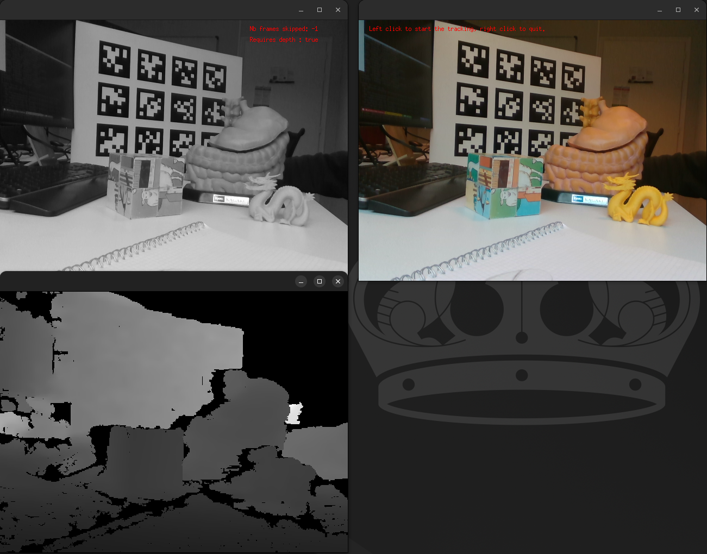
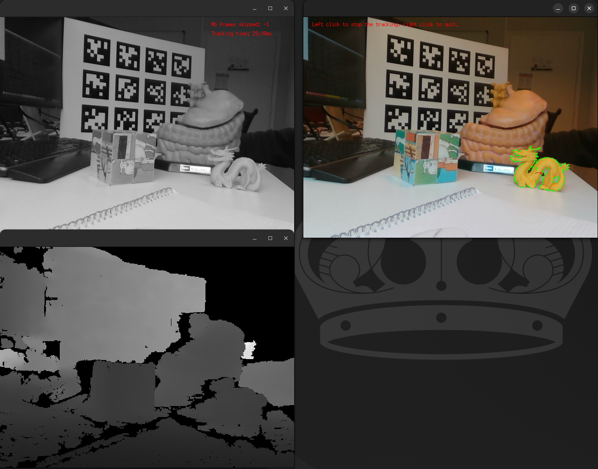

Render-Based Tracker (RBT) tutorial
===================================

This is a tutorial for the ``visp_rbt`` package. The documentation of the Render-Based Tracker (RBT) provided
by ViSP can be found `here <https://https://visp-doc.inria.fr/doxygen/visp-daily/classvpRBTracker.html>`__
ViSP documentation also provides step-by-step tutorials to progressively learn how to use the RBT
`here <https://visp-doc.inria.fr/doxygen/visp-daily/tutorial-tracking-rbt.html>`__ .

Consequently, this tutorial will not focus on explaining the meaning of the different parameters of the
RBT, but instead focus on the specificities on how to use the ``visp_rbt`` package.

Tutorial using a recorded sequence
----------------------------------

Purpose of this tutorial
++++++++++++++++++++++++

The purpose of this tutorial is to show how to configure a ``visp_rbt`` node on a recorded sequence.
We begin with this setup because it is less prone to runtime errors, such as problems with a camera.

How to launch it
++++++++++++++++
If you compiled the packages, you have to source the workspace in which you have compiled the packages.
Otherwise, if you installed the packages using the package manager, you only have to source the ``/opt/ros/${ROS_DISTRO}/setup.bash``
file (or one of the other ``setup`` files if you are not using bash).

Then you can run:

.. code-block:: shell

  ros2 launch visp_tk_tutorials rbt_json_launch.py

The launch file accepts different arguments. To have the list and the explanations related to the
arguments, please run:

.. code-block:: shell

  ros2 launch visp_tk_tutorials rbt_launch.py --show-args

You can for instance easily switch between the object to track thanks to the ``object_name`` launch argument.

When you first start the launch file, you should see something similar to the following image:

After left clicking on the image, the tracker will be turned on. Be careful, you have to do it in less than
5 seconds, because we chose to publish the initial pose of the object to track in order to avoid the initialization
from clicks. If you chose for instance to track the dragon, you should see something like the following image:

Afterwards, a left click will momentarily pause the tracker, while a right click will kill the node.

Code explanation
++++++++++++++++

Let's have a look at ``rbt_launch.py``. Because it is a fairly big file, we will study the parts
separately. Let's first have a look to the :py:func:`generate_launch_description` method that is called
by the ``ros2 launch`` utilitary or by a call to ``IncludeLaunchDescription`` in another launch file:

.. literalinclude:: /_code/launch/rbt_launch.py
  :language: python
  :lineno-match:
  :start-at: def generate_launch_description():
  :end-at: return ld

As you can see, the :py:func:`generate_launch_description` method mostly declare the launch arguments and
register an :py:class:`OpaqueFunction` object that will be called once the context of the launch file will
be known. However, it is important to notice that it also sets an OpenMP environment variable. It helps accelerate
the processing of depth images when the depth stream is used too and helps accelerate the tracker.

Here is a quick overview of the :py:func:`handle_object_parameter` function:

.. literalinclude:: /_code/launch/rbt_launch.py
  :language: python
  :lineno-match:
  :start-at: def handle_object_parameter(context):
  :end-before: def generate_launch_description():

First, we get the launch arguments values:

.. literalinclude:: /_code/launch/rbt_launch.py
  :language: python
  :lineno-match:
  :start-at: ## [Getting the values of the tracker-related launch arguments]
  :end-before: ## [Handling tracked object]

Then, we chose the object model that will be used by the RBT node from the ``object_name`` launch arguments:

.. literalinclude:: /_code/launch/rbt_launch.py
  :language: python
  :lineno-match:
  :start-at: ## [Handling tracked object]
  :end-before: ## [Sequence player]

Then, we create a node that will play the sequence, publishing the images, camera info and initial pose:

.. literalinclude:: /_code/launch/rbt_launch.py
  :language: python
  :lineno-match:
  :start-at: ## [Sequence player]
  :end-before: ## [RBT tracker node]

Then, we instanciate the ``visp_rbt`` node, using the dictionnary that we previously filled:

.. literalinclude:: /_code/launch/rbt_launch.py
  :language: python
  :lineno-match:
  :start-at: ## [RBT tracker node]
  :end-before: ## [Shutdown-event handler]

Finally, we ask to shutdown the whole launch file when the ``visp_rbt`` node dies:

.. literalinclude:: /_code/launch/rbt_launch.py
  :language: python
  :lineno-match:
  :start-at: ## [Shutdown-event handler]
  :end-before: ## [Returning launch description items]
